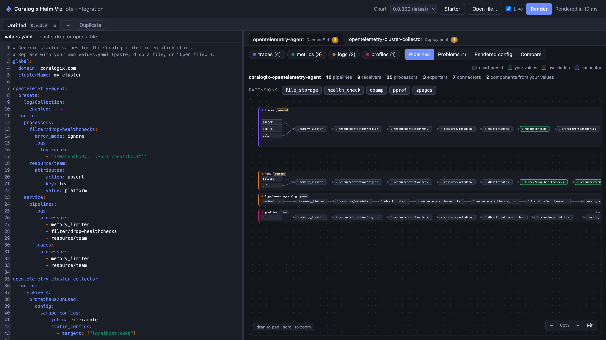

# cx-helm-viz

An otelbin.io-style visualiser for the Coralogix `otel-integration` Helm chart.
Paste or open a `values.yaml`. The tool runs `helm template` against the real chart,
so the graph shows the **effective** collector config after the chart's presets have merged in.



```bash
uv run server.py            # or: python3 server.py   (needs pyyaml + helm on PATH)
# → http://127.0.0.1:8765
```

Options: `--chart ./path/to/otel-integration` renders a local chart checkout. `--port`, `--no-browser` and `-v` also work.

## Requirements and network access

- **Python 3.9+** with `pyyaml`. `uv run server.py` installs it automatically.
- **`helm`** on your `PATH`, or set `HELM_BIN`.
- **Chart downloads.** The first time you use a chart version, the server downloads it from Coralogix's public chart repository (`https://cgx.jfrog.io/artifactory/coralogix-charts-virtual`) and caches it in `~/.cache/cx-helm-viz`; set `CX_HELM_VIZ_CACHE` to change where. The version list comes from a `coralogix` repo in your local helm config (`helm repo add coralogix https://cgx.jfrog.io/artifactory/coralogix-charts-virtual`); without it, only the latest version is offered. Use `--chart` to work fully offline.
- **Browser libraries.** The page loads CodeMirror (the editor) and jsdiff (the diffs) from cdnjs, pinned with integrity hashes. Without them the editor falls back to a plain text box and the line diffs are unavailable; everything else works.

## Privacy

- **Your values never leave your machine.** The browser sends them only to the local server, which renders them with your local `helm`. The server listens on `127.0.0.1` by default; don't expose it with `--host` on a shared network. The only outbound requests are the chart downloads and the cdnjs libraries above, and neither carries your values.
- **Tabs are stored in your browser.** Every tab's full `values.yaml` is kept in the browser's local storage for this site (`localhost:8765`), so it survives a reload. If you paste a customer's config, it stays there until you close the tab. Closing all tabs, or clearing site data for `localhost:8765`, removes it.
- **Templated secrets aren't evaluated.** `{{ ... }}` expressions are replaced with placeholders rather than run, so tools like `exec` never execute.

## What you get

- **Tabs for comparing.** Each tab has its own `values.yaml`, chart version, render and graph position. **Duplicate** a tab and pick another chart version to compare releases, or open several values files (each file opens in its own tab). Double-click a tab to rename it. Tabs are saved in your browser's local storage.
- **Compare** diffs this tab against another tab (other → this). **Summary** lists added, removed and changed pipelines and components, including processor order changes and new or fixed problems; each changed component has an inline YAML diff. **Rendered config** is a unified diff of the effective collector config, so preset changes between chart versions show up. **values.yaml** diffs the inputs. **⇄ Swap** flips the direction.
- **One tab per collector** (agent DaemonSet, cluster-collector Deployment, gateway, and so on), with error and warning badges.
- **One pan/zoom graph** (like otelbin). Each pipeline is a lane, grouped by signal: receivers → numbered processor chain → exporters. Connectors (`spanmetrics`, `forward/*`) are dashed. A pipeline fed by a connector starts to the right of the pipeline exporting to it, so everything flows left to right and nothing loops back. Drag to pan and scroll to zoom. **Fit** shows the whole graph. Hovering a component highlights it and its edges in every pipeline.
- **Provenance colouring.** The chart is rendered a second time with every `config:` block removed. Comparing the two renders tags each component as a *chart preset*, *your values* or *overridden*. This makes it obvious when presets add processors (for example `k8sattributes` and `batch`) around the ones you listed.
- **Details drawer**: the merged YAML for the component, which pipelines use it, a docs link and "Show in values.yaml".
- **Problems**: references to undefined components, defined but unused components, connectors wired on only one side, duplicate entries, unknown signal types, undefined or disabled extensions, and ordering hints for `memory_limiter` and `batch`.
- **Rendered config**: the final collector YAML, with copy and download buttons.

## Templated values files

Expressions such as `{{ exec "secret-tool" ... }}` (helmfile or gomplate) are swapped for `TEMPLATED_n` placeholders so the file still parses. The tool lists each substitution. `${var}` and `${env:VAR}` are kept as literal text.

## Layout

```
server.py            stdlib HTTP server (localhost only)
cxviz/templating.py  neutralise non-Helm templating
cxviz/helm.py        chart version lookup, pull + cache (~/.cache/cx-helm-viz), render
cxviz/manifest.py    extract collector configs (ConfigMaps + OpenTelemetryCollector CRs)
cxviz/analyze.py     graph model, provenance, lint
cxviz/service.py     end-to-end pipeline
static/graph.js      single-canvas lane layout, edges, pan/zoom
static/workspace.js  tabs: per-tab values/version/render, persistence, file loading
static/compare.js    tab-vs-tab structural and line diffs (jsdiff from cdnjs, with SRI)
static/              UI (CodeMirror from cdnjs with SRI; falls back to a textarea offline)
tests/               python3 -m pytest
```

## License

[MIT](LICENSE)
